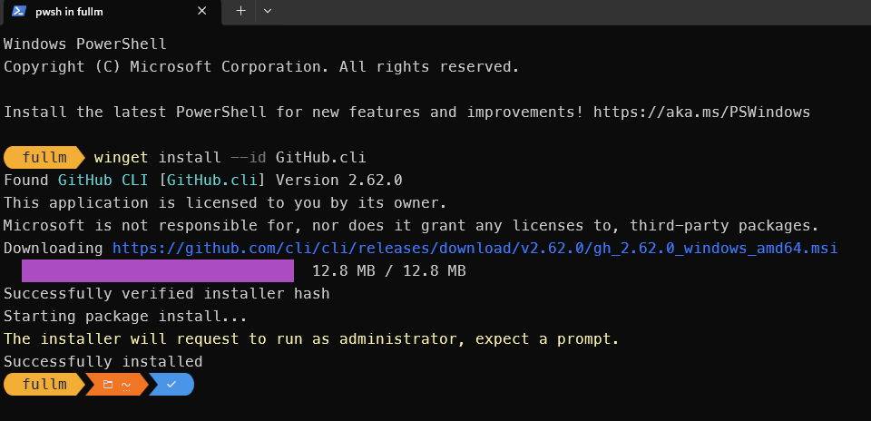
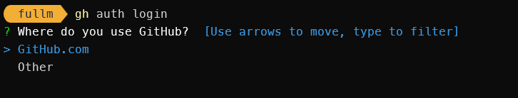
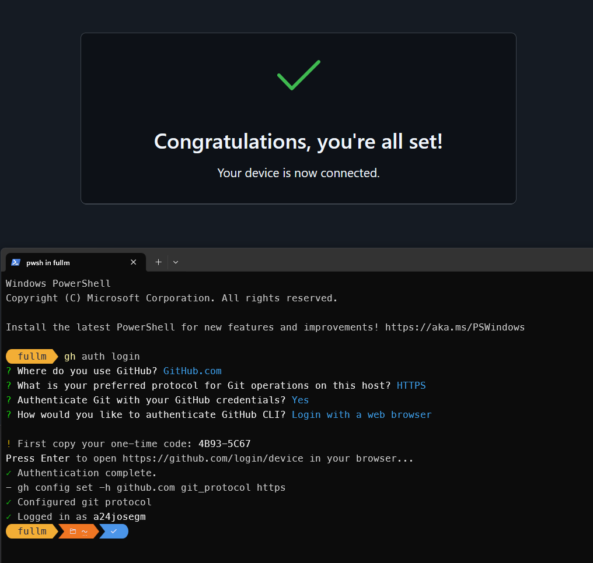
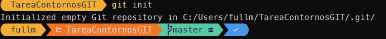
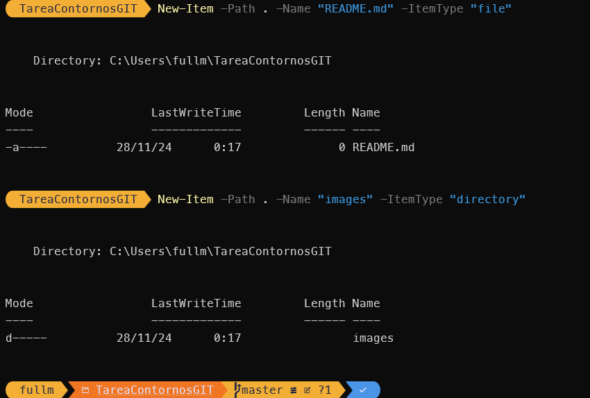
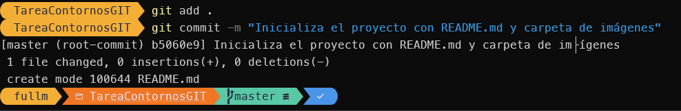
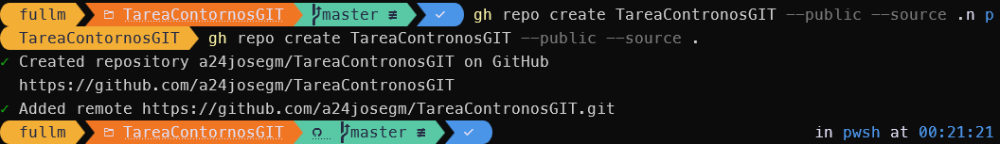
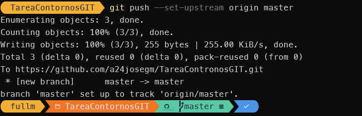

# Documentación del Proyecto

#He creado el repositorio y he hecho los cambios desde Terminal de Powershell.

#Primero instalo la herramienta de terminal de GIT
winget install --id GitHub.cli

#Iniciamos sesion desde cli
gh auth login 

#Selecionamos https y desde el navegador con la cuenta iniciada abrimos github y nos autorizamos.

#ahora estamos authenticados vamos a crea un repo.
#Dentro de la carpeta en la que queremos crear el repositorio:
git init

#Agregar un README.md y la Carpeta de Imágenes 
New-Item -Path . -Name "README.md" -ItemType "file"
New-Item -Path . -Name "images" -ItemType "directory" 

#Realizamos un commit
git add . 
git commit -m "Inicializa el proyecto con README.md y carpeta de imágenes” 

#Crear el repo en GitHub
gh repo create TareaContronosGIT --public --source . 

#Hacer la subida y definer el upstream.
git push --set-upstream origin master

